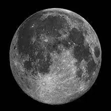
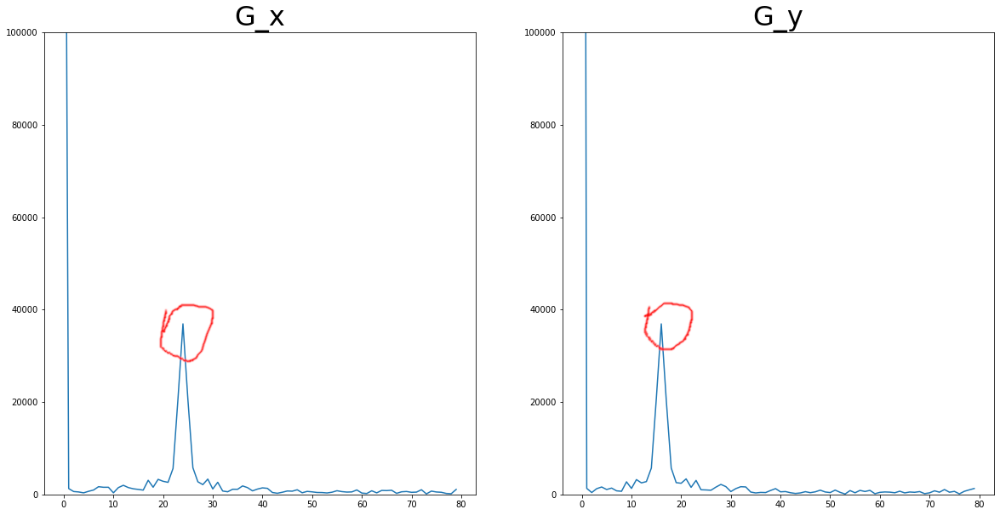
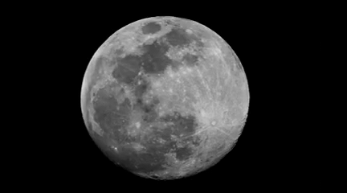
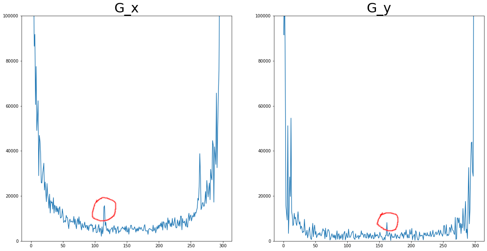

demo_velocity_estimation_1.py  

This demo shows how to estimate the velocity of a moving object (x and y components, pixels / frame)  
    in the frequency domain based on the uniformly acquired frames
        
This demo uses a simulation: a moving UFO is superimposed on the image of moon  
    
A sequence of uniform frames (20 fps): 

  

FFT spectra: 

  

UFO
Given:
 V_x = 3.00 [pixels / frame] V_y = 2.00 [pixels / frame]
Calculated:
 V_x = 3.00 [pixels / frame] V_y = 2.00 [pixels / frame]
 

demo_velocity_estimation_2.py  

This demo shows how to estimate the velocity of a moving object (x and y components, pixels / frame)  
    in the frequency domain based on the uniformly acquired frames  
    
This demo uses a real video of the international space station (ISS) transitting between  
    earth and moon  
Video copyright: Matt Skuta (https://www.youtube.com/watch?v=bl9KHmoRGi0)  
    
    
A sequence of uniform frames (20 fps): 

  

FFT spectra: 

  

ISS
Calculated:
 V_x = 2.30 [pixels / frame] V_y = 3.24 [pixels / frame]
